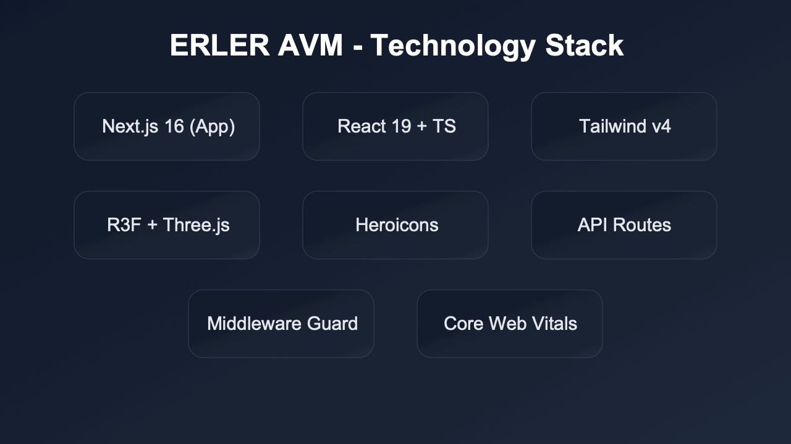
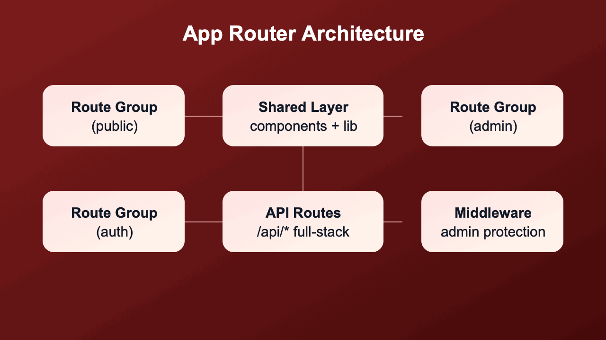
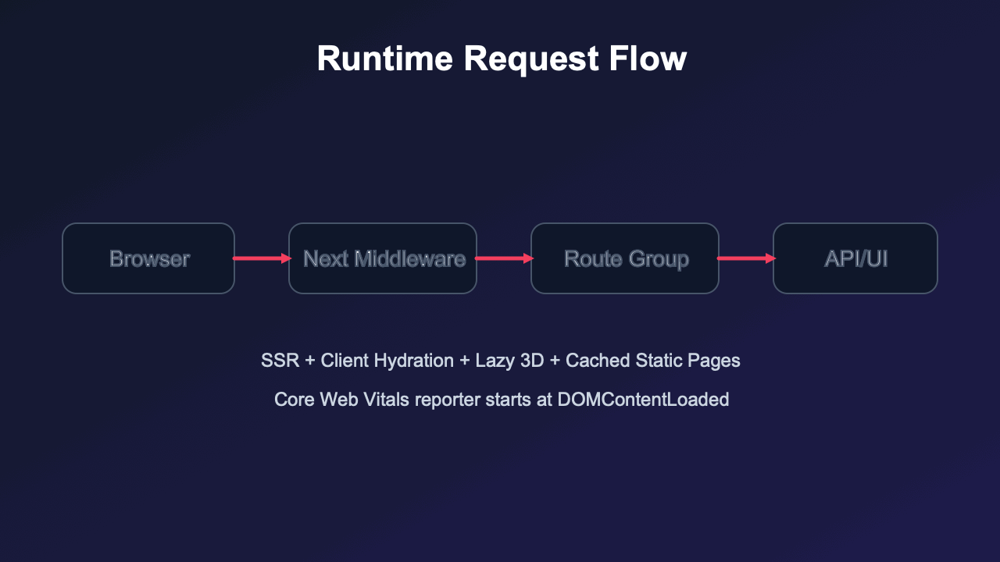

# ERLER AVM
Kirmizi-beyaz premium e-ticaret arayuzu. Next.js App Router tabanli, route-group mimarisiyla public/admin/auth alanlari ayrik olarak calisir.

## Teknoloji (GIF)


- Framework: `Next.js 16` (App Router)
- UI: `React 19` + `TypeScript` + `Tailwind CSS v4`
- 3D: `three.js` + `@react-three/fiber` + `@react-three/drei`
- Ikonlar: `@heroicons/react`
- Full-stack endpointler: `app/api/*`
- Performans: lazy 3D mount + image format optimizasyonu + web vitals reporter

## Mimari Yapi (GIF)



### Route Group Ayrimi
```text
app/
  (public)/        -> storefront
  (auth)/          -> login/auth ekranlari
  (admin)/admin/   -> admin panel
  api/             -> full-stack endpointler
```

### Katmanlar
- `components/*`: layout, home, checkout, product, ui
- `lib/*`: constants, domain mock data, format, commerce, auth/db baglantilari
- `middleware`: admin koruma ve route kontrolleri

## Arayuz Ornekleri (GIF)


## Lokal Calistirma
```bash
npm install
npm run dev
```

Build kontrol:
```bash
npm run lint
npm run build
```

## Versioning ve Tag Politikasi
Her guncelleme:
1. `patch` versiyon bump
2. zengin commit mesaji
3. annoted tag
4. `main` + tag push

### Guncel Tag Seti
`v0.2.0, v0.2.1, v0.2.2, v0.2.3, v0.2.4, v0.2.5, v0.2.6, v0.2.7, v0.2.8, v0.2.9, v0.2.10, v0.2.11, v0.2.12, v0.2.13, v0.2.14, v0.2.15, v0.2.16, v0.2.17, v0.2.18, v0.2.19`
